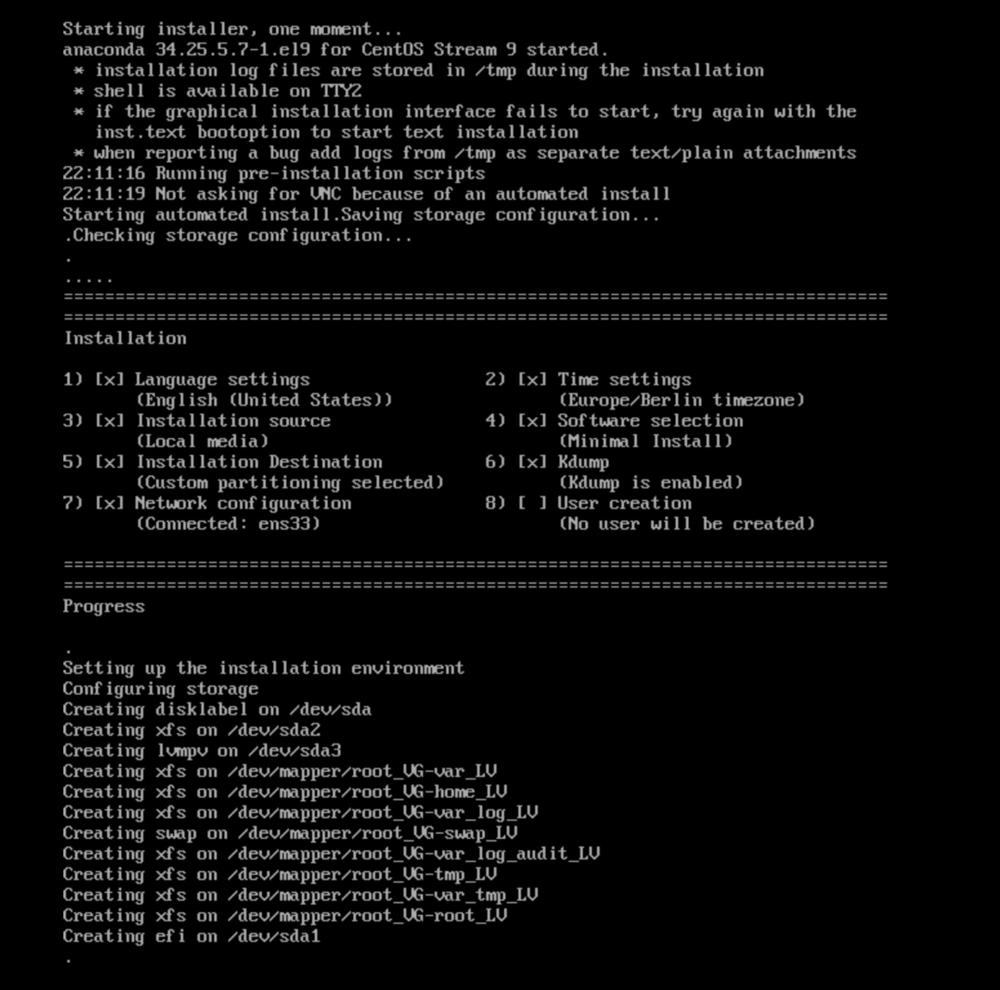
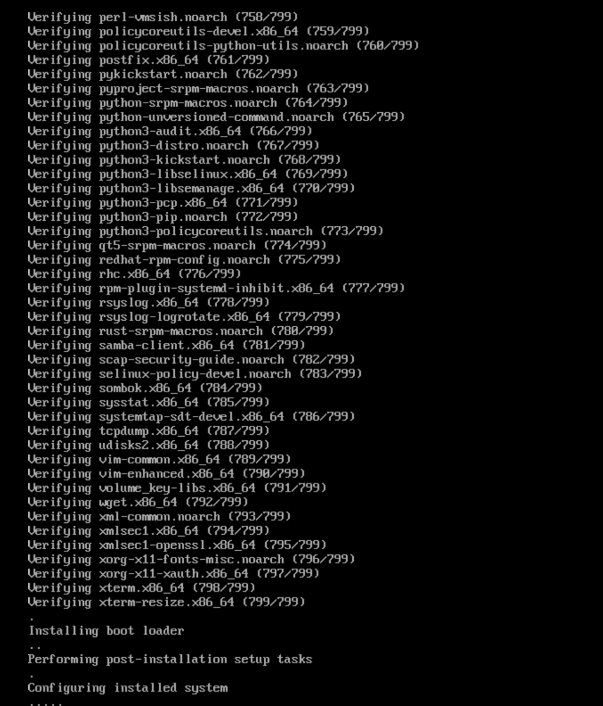
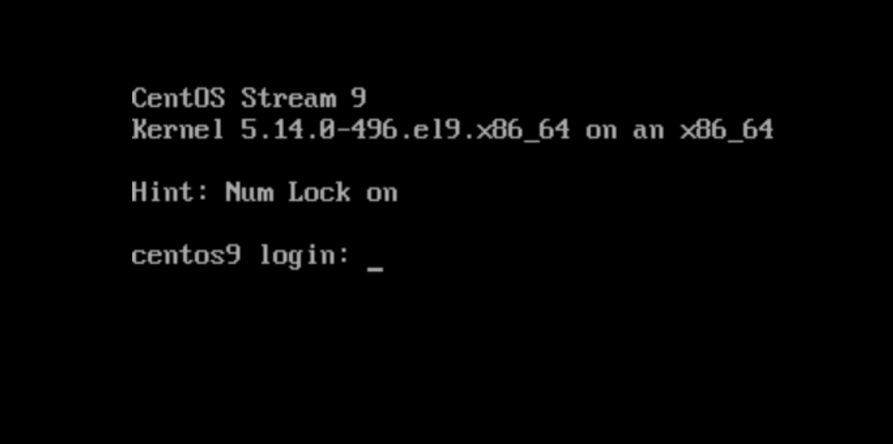

# How to prepare own custom (via kickstart) Centos9 ISO file 
*steps tested on centos9*
#


**Download files:**
```
wget https://raw.githubusercontent.com/pkoperwas/custom-centos9/main/ks.cfg -O /nfs-server/ks.cfg
wget http://mirroronet.pl/pub/mirrors/centos-stream/9-stream/BaseOS/x86_64/iso/CentOS-Stream-9-latest-x86_64-dvd1.iso -O /nfs-server/CentOS-Stream-9-latest-x86_64-dvd1.iso
```

**Prepare custom ISO on your linux**
```
mount -o loop /nfs-server/CentOS-Stream-9-latest-x86_64-dvd1.iso /mnt
shopt -s dotglob
mkdir /nfs-server/centos9iso
cp -pvRf /mnt/* /nfs-server/centos9iso
umount /mnt
```

**Make a Note of the ISO’s Label**  currently for CentOS-Stream-9-latest-x86_64-dvd1.iso is LABEL="CentOS-Stream-9-BaseOS-x86_64"
```
blkid /nfs-server/CentOS-Stream-9-latest-x86_64-dvd1.iso
```

**Copy Kickstart File Into ISO Directory**
```
cp /nfs-server/ks.cfg /nfs-server/centos9iso
```

**Check isolinux Menu for Linux Install Entry**
```
grep -A4 "^label linux" /nfs-server/centos9iso/isolinux/isolinux.cfg
```

**Modify the isolinux.cfg file to Point to the New Kickstart File**
```
sed -i '/^\s*append initrd=/ s/$/ inst.ks=cdrom:\/ks.cfg/' /nfs-server/centos9iso/isolinux/isolinux.cfg
sed -i '/^[[:space:]]*kernel @KERNELPATH@ @ROOT@ quiet/s/$/ inst.ks=cdrom:\/ks.cfg/' /nfs-server/centos9iso/isolinux/grub.conf
sed -i 's/^default=1/default=0/' /nfs-server/centos9iso/isolinux/grub.conf
sed -i 's/^timeout 60/timeout 1/' /nfs-server/centos9iso/isolinux/grub.conf
sed -i 's/set default="1"/set default="0"/' /nfs-server/centos9iso/EFI/BOOT/grub.cfg
sed -i 's/set timeout=60/set timeout=1/' /nfs-server/centos9iso/EFI/BOOT/grub.cfg
sed -i '/^[[:space:]]*linuxefi \/images\/pxeboot\/vmlinuz inst.stage2=hd:LABEL=CentOS-Stream-9-BaseOS-x86_64 quiet/s/$/ inst.ks=cdrom:\/ks.cfg/' /nfs-server/centos9iso/EFI/BOOT/grub.cfg

```

**Generate the New ISO**
```
dnf install genisoimage -y
mkisofs \
-o /nfs-server/custom-centos9.iso \
-b isolinux/isolinux.bin \
-J -joliet-long -R -l -v \
-c isolinux/boot.cat \
-no-emul-boot \
-boot-load-size 4 \
-boot-info-table \
-eltorito-alt-boot \
-e images/efiboot.img \
-no-emul-boot \
-graft-points \
-V "CentOS-Stream-9-BaseOS-x86_64" \
-jcharset utf-8 /nfs-server/centos9iso
```

**Make the ISO UEFI Bootable**
```
dnf install syslinux -y
isohybrid --uefi /nfs-server/custom-centos9.iso
```

**Implant Checksum for New ISO**
```
dnf install isomd5sum -y
implantisomd5 /nfs-server/custom-centos9.iso
```

> [!WARNING]
> In case of starting installation on VMWare make sure you are creating a virtual machine profile Centos9 or if 9 not visible you can choose Centos8, please don't use RHEL9 as this system by default enables UEFI Secure Boot with Official Centos ISO image doesn't support. (Botloader and Kernel are not signed by UEFI)




